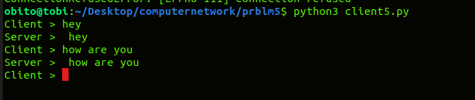
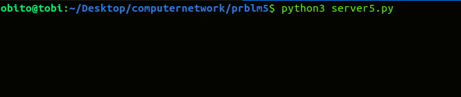

# APPLICATION USING TCP SOCKETS - CREATING ECHO CLIENT-SERVER
# EXP: 5
# DATE:26-04-2023
# AIM:
To write a python program for creating Echo Client and Echo Server using TCP Sockets Links.

# ALGORITHM:
Import the necessary modules in python
Create a socket connection to using the socket module.
Send message to the client and receive the message from the client using the Socket module in server.
Send and receive the message using the send function in socket.

# PROGRAM:
# CLIENT:
```
import socket
s=socket.socket()
s.connect(('localhost',8000))
while True:
   msg=input("Client > ")
   s.send(msg.encode())
   print("Server > ",s.recv(1024).decode())
```
# SERVER:
```
import socket
s=socket.socket()
s.bind(('localhost',8000))
s.listen(5)
c,addr=s.accept()
while True:
   ClientMessage=c.recv(1024).decode()
   c.send(ClientMessage.encode())
```
# CLIENT OUTPUT :


# SERVER OUTPUT :


# RESULT:
Thus, the python program for creating Echo Client and Echo Server using TCP Sockets Links was successfully created and executed.
